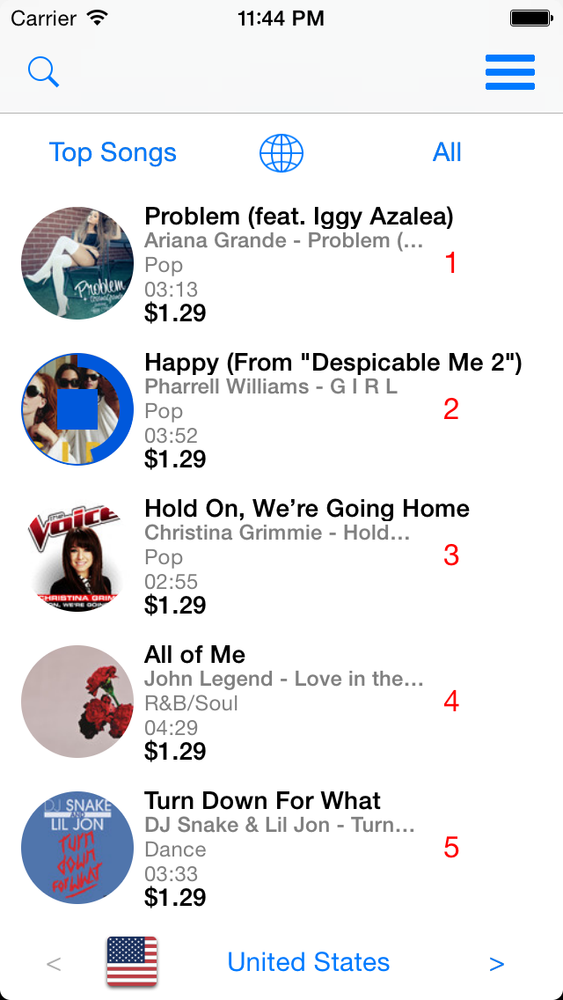
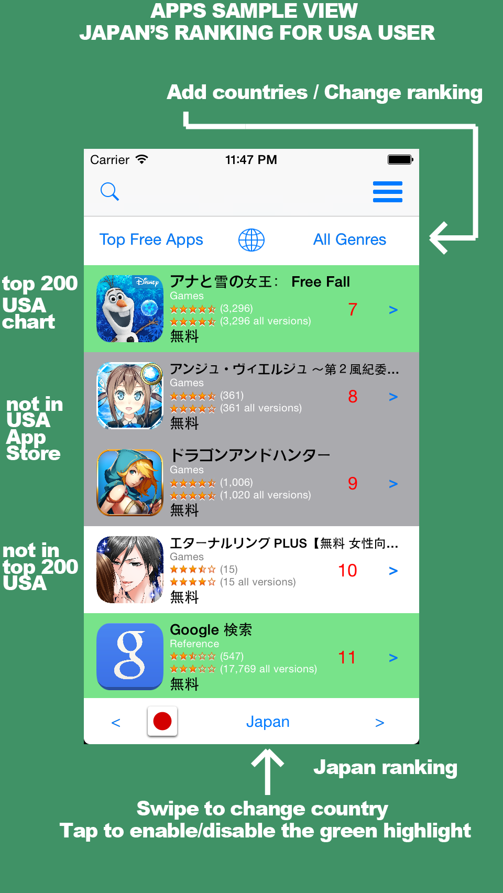

iTunesPicker
============

A complete App to discover, search and compare rankings for apps, books, movies and music **from iTunes in any available country**.

#### Why another picker?
- iTunes charts are available only for your country, with iTunesPicker you can discover apps (and others items) in the world rankings and compare the position (top 200 is the iTunes API limit) for an app (book,movie,music) in the world rankings.

- you can include iTunesPicker in your app to encourage the download of your others apps (without breaking the approval rule 2.25), you can show your others apps in the App Store with a few lines of code. 

```objc
//Sample code in ITPPickerDetailViewController.m
NSString* iTunesUserCountry = @"ITUNES COUNTRY ISO CODE";
//ACKEntitiesContainer can handle/compare multiple coutries
self.entitiesDatasources = [[ACKEntitiesContainer alloc]initWithUserCountry:iTunesUserCountry entityType:kITunesEntityTypeSoftware limit:kITunesMaxLimitLoadEntities];
//ITPPickerTableViewController is a controller to show your apps
ITPPickerTableViewController* pickerTableView = [[ITPPickerTableViewController alloc]initWithNibName:nil bundle:nil];
pickerTableView.delegate = self;
[pickerTableView loadEntitiesForArtistId:@"YOUR ARTIST ID HERE" inITunesCountry:iTunesUserCountry withType:kITunesEntityTypeSoftware completionBlock:^(NSArray *array, NSError *err) {
        [self.navigationController pushViewController:pickerTableView animated:YES];
}];
```

To retrive the "ITUNES COUNTRY ISO CODE" you can use:

- a country picker in iTunesPicker (user choice)
- current locale (the iTunes account could be in a different country)
- use in-app purchase pruduct identifier (probably the best way):

```objc
[ACKITunesQuery getITunesStoreCountryUserAccountByProductId:@"AN IN-APP PURCHASE PRODUCT ID" completionBlock:^(NSString *country, NSError *err) {
 //country is the ITUNES (AppStore) COUNTRY
}];
```

iTunesPicker requires iOS 7, ARC, AppCornerKit framework (simplifies communication with iTunes API, included in the external folder, free for unlimited use) and has been tested on iPhone 5S.

**Author**: Denis Berton [@DenisBerton](https://twitter.com/DenisBerton)

 
 
 
 
(During development the layout could be changed)


#### Project Status
iTunesPicker works with **apps**, songs, albums, movies and ebooks.
I'm developing the missing iTunes items, open an issue for other types you need to support.
In the next step I will add rankings's trends (up/down arrows) for each item and "best deal" function to see "price drop" list (thanks to Nam for your suggestion).

I'd love to have your contribution to iTunesPicker. There are several ways to contribute:

- Translation in other languages
- Build an interface for iPad 
- Suggest new features

Work in progress, stay tuned!

####Publish on AppStore
iTunesPicker is not published on the AppStore by appcorner.it, you're free to publish this version "as is" on App Store (with quote of this repository in the app description) or with your changes.
The app "as is" could not pass the approval rules of AppStore, for rule 8.1 cannot contain "iTunes" in the app name, for rule 2.25 you should remove apps ranking or insert in your app's description a disclaimer like "This application is for entertainment only and is not affiliated with iTunes. iTunes is a trademarks of Apple Inc" (thanks to Nam for your suggestion).

To enable iAd set on iTunesPicker-Prefix.pch
```objc
#define IAD_BANNER_ENABLE 1
```
**Let me know if you include the picker in your app.**
