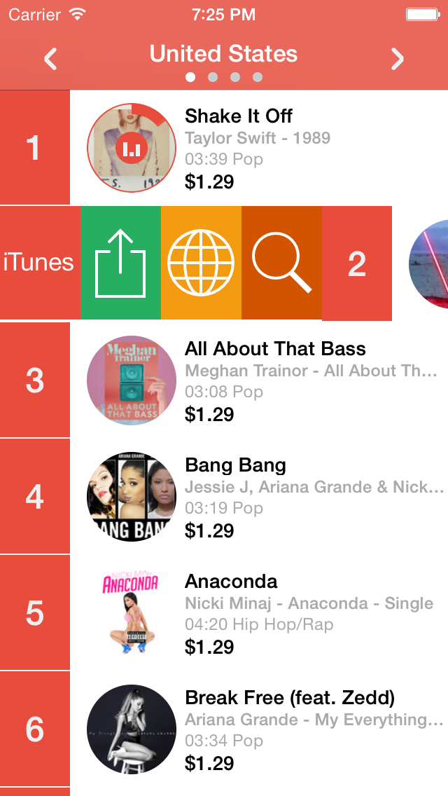

iTunesPicker 2.0.0
============

A complete App to discover, search and compare rankings for apps, books, movies and music **from iTunes in any available country**.

Charts supported by the current version:
iOS Apps, iPad Apps, Mac Apps, Music (Song and Albums), Music Videos, Ebooks, Movies.

Search Music, Movies and Music Videos on YouTube.

iTunesPicker requires iOS 7, ARC, AppCornerKit framework (simplifies communication with iTunes API, included in the external folder, free for unlimited use) and has been tested on iPhone 5S.

**Author**: Denis Berton [@DenisBerton](https://twitter.com/DenisBerton)

 

[Video for the old version 1.0.0 with missing features and graphics](https://www.youtube.com/watch?v=rpfFmVLQiGI)

#### Why another picker?
- iTunes charts are available only for your country, with iTunesPicker you can discover apps (and others items) and compare the position for an app (book,movie,music) in the world rankings.

- you can include iTunesPicker in your app to encourage the download of your others apps (without breaking the approval rule 2.25), you can show your others apps in the App Store with a few lines of code. 

```objc
//Sample code in ITPPickerDetailViewController.m
NSString* iTunesUserCountry = @"ITUNES COUNTRY ISO CODE";
//ACKEntitiesContainer can handle/compare multiple coutries
self.entitiesDatasources = [[ACKEntitiesContainer alloc]initWithUserCountry:iTunesUserCountry entityType:kITunesEntityTypeSoftware limit:kITunesMaxLimitLoadEntities];
//ITPPickerTableViewController is a controller to show your apps
ITPPickerTableViewController* pickerTableView = [[ITPPickerTableViewController alloc]initWithNibName:nil bundle:nil];
pickerTableView.delegate = self;
[pickerTableView loadEntitiesForArtistId:@"YOUR ARTIST ID HERE" inITunesCountry:iTunesUserCountry withType:kITunesEntityTypeSoftware completionBlock:^(NSArray *array, NSError *err) {
        [self.navigationController pushViewController:pickerTableView animated:YES];
}];
```

To retrive the "ITUNES COUNTRY ISO CODE" you can use:

- a country picker in iTunesPicker (user choice)
- current locale (the iTunes account could be in a different country)
- use in-app purchase pruduct identifier (probably the best way):

```objc
[ACKITunesQuery getITunesStoreCountryUserAccountByProductId:@"AN IN-APP PURCHASE PRODUCT ID" completionBlock:^(NSString *country, NSError *err) {
 //country is the ITUNES (AppStore) COUNTRY
}];
```

#### Project Status
I'm developing the missing iTunes items, open an issue for other types you need to support.
In the next step I will add rankings's trends (up/down arrows) for each item and "best deal" function to see "price drop" list.

I'd love to have your contribution to iTunesPicker. There are several ways to contribute:

- Translation in other languages
- Build an interface for iPad 
- Suggest new features

Work in progress, stay tuned!

####Publish on AppStore
iTunesPicker is not published on the AppStore by appcorner.it, you're free to publish this version "as is" on App Store (please quote this repository in the app description) or with your changes.

The app "as is" could not pass the approval rules of AppStore:
- rule 8.1 cannot contain "iTunes" in the app name
- rule 8.3 could be evaluated similar to iTunes
- rule 2.25 you should remove apps ranking.

To enable remote configuration set on iTunesPicker-Prefix.pch
```objc
#define REMOTE_CONFIGURATION_ENABLE 1
#define REMOTE_CONFIGURATION_SERVER_URL @"http://example.com/defaults.plist" //upload the file on your server
#define DEFAULT_ACK_TYPES @[@(kITunesEntityTypeSoftware),@(kITunesEntityTypeMusic),@(kITunesEntityTypeEBook),@(kITunesEntityTypeMovie)]; //change types loaded by default on first time (offline) 
```

To enable YouTube search add your api key in iTunesPicker-Prefix.pch
```objc
#define YOUTUBE_API_KEY @""
```

**Let me know if you include the picker in your app.**
